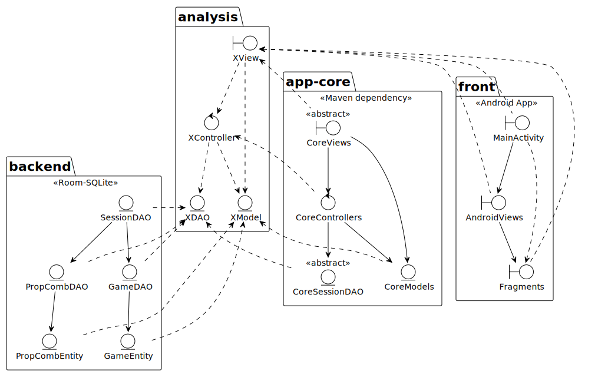
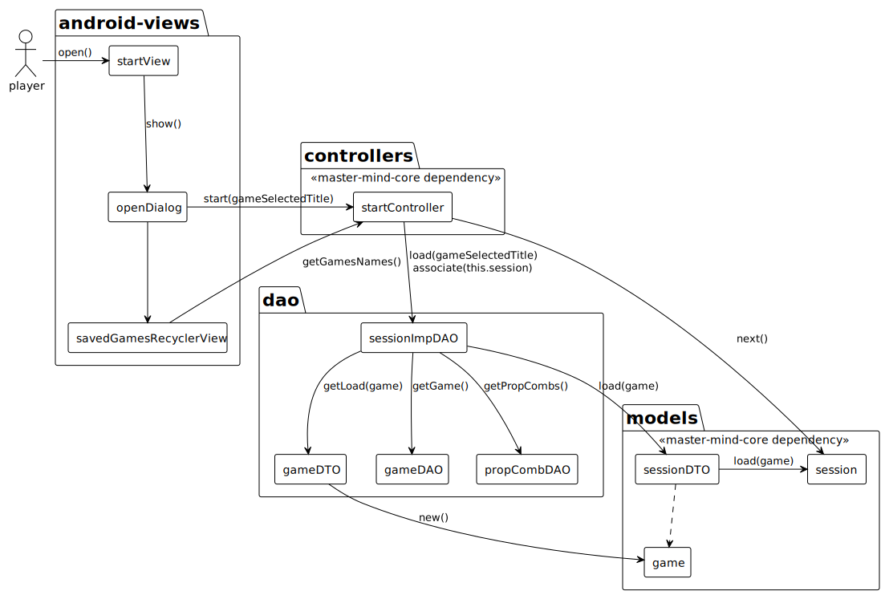
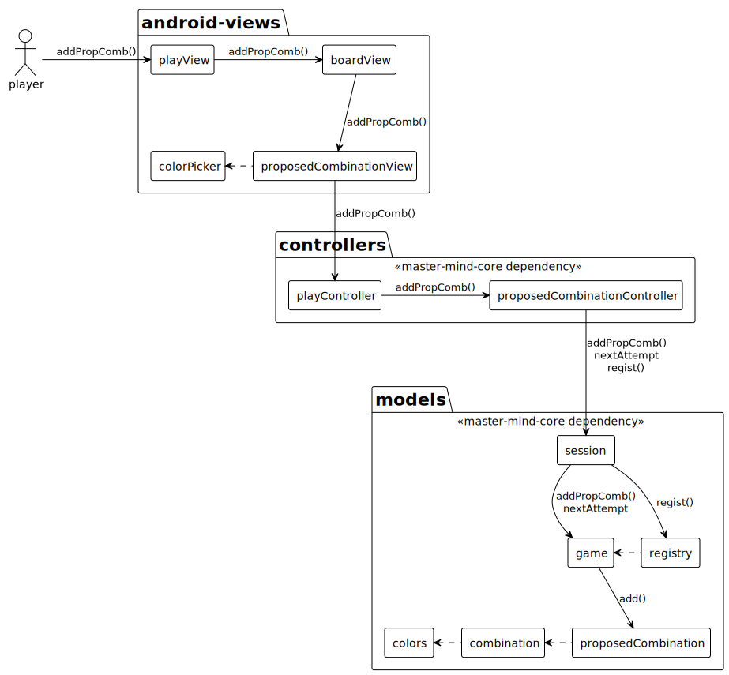
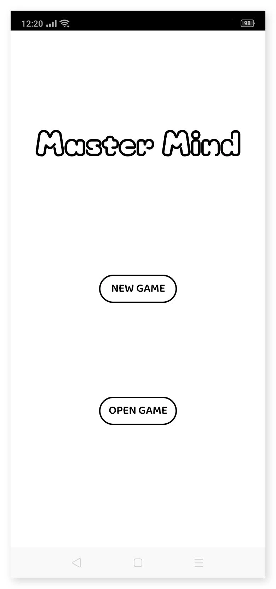
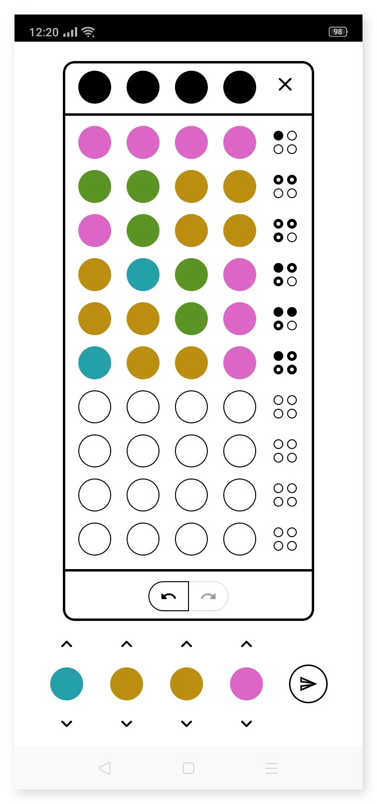
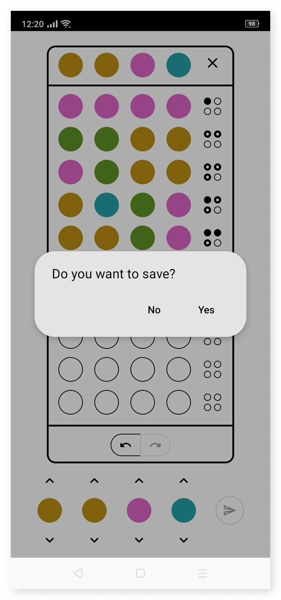
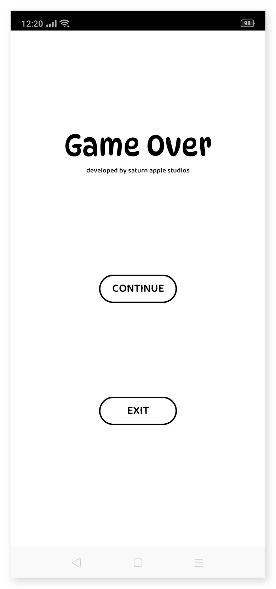

# Master Mind Android

### Index
- **[Description](#description)**
- **[Documentation](#documentation)**
  - **[Architecture Design](#architecture-design)**
  - **[Colaboration Diagram 'Open Case'](#colaboration-diagram-open-case)**
  - **[ProposeCombination Case](#colaboration-diagram-proposecombination-case)**
- **[User Interface](#user-interface)**

## Description
The android application implemetes the application core interfaces by using its view technology (Activities, Framents) and SQLite for the persistence of games.

**[Here you can check the core application documentation](https://github.com/PacoMorando/master-mind-core)**

## Documentation

### Architecture Design

### Colaboration Diagram 'Open Case'

### Colaboration Diagram 'ProposeCombination Case'

## User Interface

|  |  |
|---|---|
|  | |

|  |  |
|---|---|
|  | |
